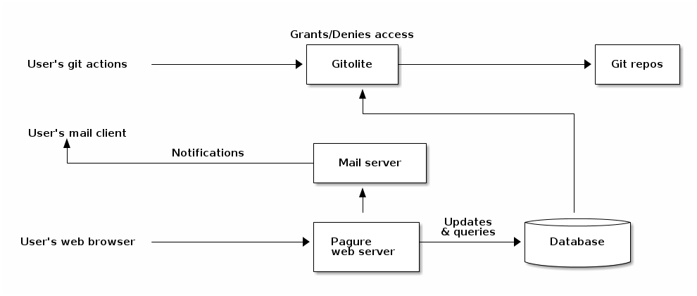
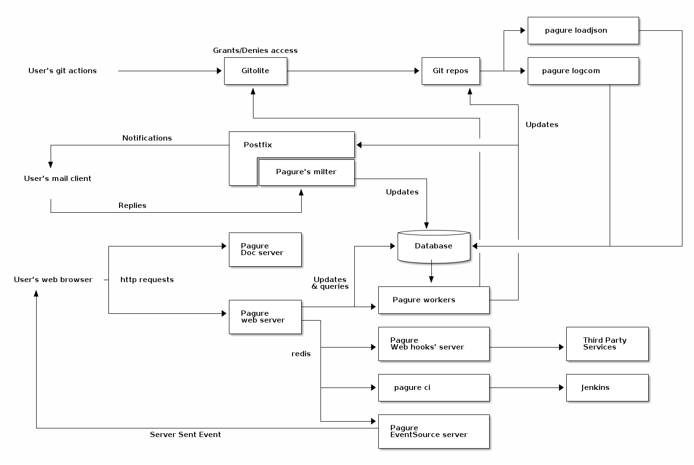

# pagure

```
Something I hope you know before go into the coding~
* First, please watch or star this repo, I'll be more happy if you follow me.
* Bug report, questions and discussion are welcome, you can post an issue or pull a request.
```


* Pagure 全拼 "Paguroidea"，法语单词，属于**寄居蟹**科的甲壳类动物
* Paugre 是一个典型的git Server，类似于gitlab、github
* Fedora、Centos操作系统发行版用于托管rpm代码仓
* 核心组件：gitolite（鉴权）、pygit2（git操作）

## 相关站点

* 官方源码：<https://pagure.io/pagure>
* 官方文档：<https://docs.pagure.org/pagure/>
* Fedora发行版代码托管：<https://pagure.io/>
* CentOS发行版代码托管：<https://git.centos.org/>

## 目录

* [pagure介绍](docs/pagure介绍.md)
* [pagure部署](docs/pagure部署.md)
* [pagure容器化部署](docs/pagure容器化部署.md)
* [pagure源码分析](docs/pagure源码分析.md)
    * [镜像站点流程](docs/pagure源码分析/镜像站点流程.md)
    * [注册邮箱验证流程](docs/pagure源码分析/注册邮箱验证流程.md)
    * [group与仓库绑定关系分析](docs/pagure源码分析/group与仓库绑定关系分析.md)
    * [pagure与gitolite交互](docs/pagure源码分析/pagure与gitolite交互.md)
    * [pygit2如何调用libgit2](docs/pagure源码分析/pygit2如何调用libgit2.md)
    * [API](docs/pagure源码分析/API.md)
        * [获取仓库分支信息](docs/pagure源码分析/API/获取仓库分支信息.md)


## 图示






---
