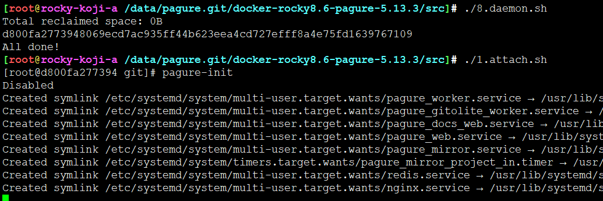
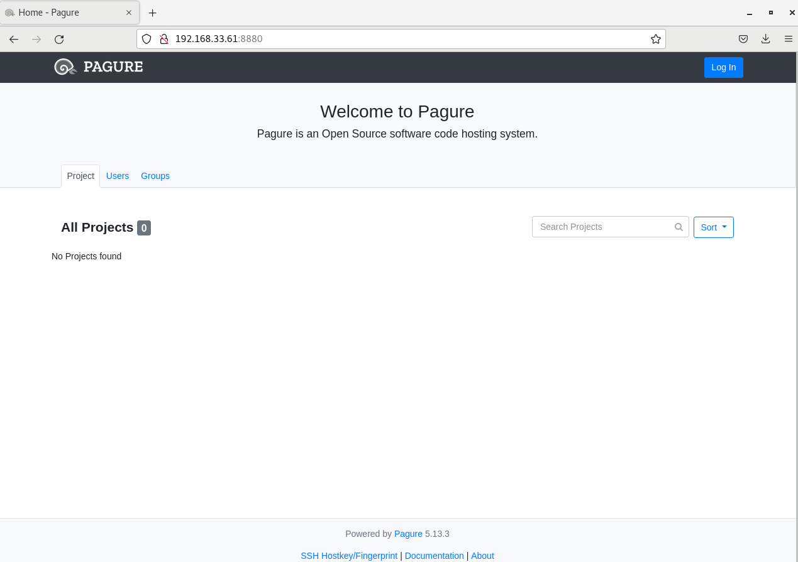
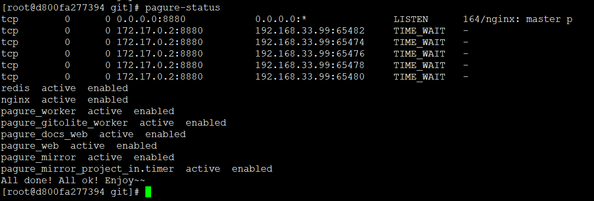
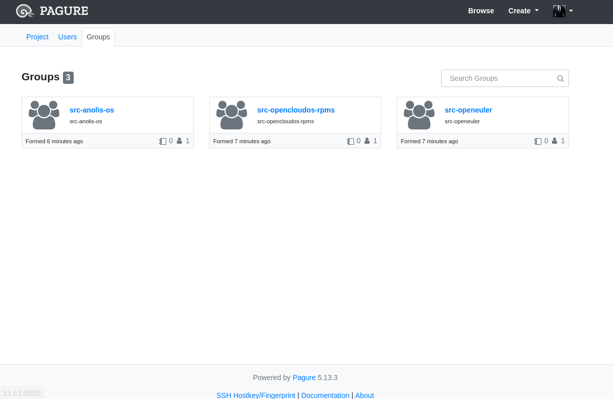
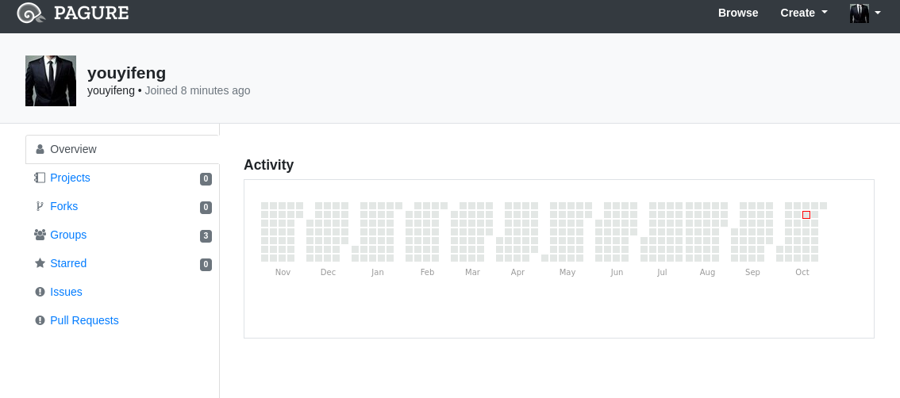

# pagure容器化部署


## 构建容器镜像

执行 0.build.sh

```
docker build -t rockylinux8.6-pagure .
```

## 运行容器

```
#!/bin/bash

set -e

docker container prune -f

[ ! -d home-git ] && mkdir home-git

docker run --privileged -d -v `pwd`/home-git:/home/git -p 8880:8880 -p 8822:22 --name rocky8.6-pagure rockylinux8.6-pagure /usr/sbin/init

echo "All done!"
```

## 初始化pagure




attach 到容器，执行pagure-init


## 浏览器访问

```
http://localhost:8880
```

localhost根据实际配置修改






# 效果







---
