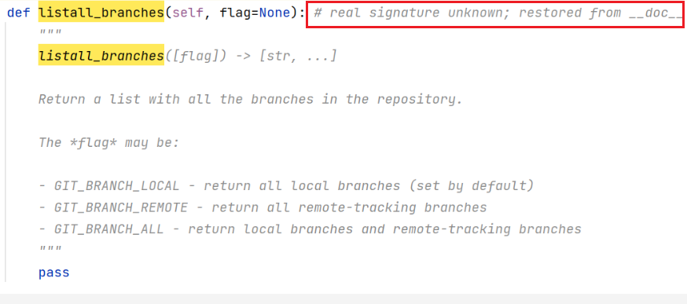

# 获取仓库分支信息

# 获取所有分支

```
http://192.168.32.139:5000/api/0/anaconda/git/branches
```

```
{
     "branches": [
          "master",
          "openEuler-20.03-LTS",
          "openEuler-20.03-LTS-Next",
          "openEuler-20.03-LTS-SP1",
          "openEuler-20.03-LTS-SP2",
          "openEuler-20.09",
          "openEuler-21.03",
          "openEuler1.0",
          "openEuler1.0-base"
     ],
     "default": "master",
     "total_branches": 9
}
```

pagure/api/__init__.py

```
@API.route("/")
def api():
    """ Display the api information page. """

    sections = []

    projects_methods = [
        ...
        project.api_new_git_tags,
        project.api_git_branches,
```

pagure/api/project.py

```
@API.route("/<repo>/git/branches")
@API.route("/<namespace>/<repo>/git/branches")
@API.route("/fork/<username>/<repo>/git/branches")
@API.route("/fork/<username>/<namespace>/<repo>/git/branches")
@api_method
def api_git_branches(repo, username=None, namespace=None):
    with_commits = pagure.utils.is_true(
        flask.request.values.get("with_commits", False)
    )

    repo = _get_repo(repo, username, namespace)

    branches = pagure.lib.git.get_git_branches(repo,with_commits=with_commits)
    default_name = default_commit = None
    try:
        default_name, default_commit = pagure.lib.git.get_default_git_branches(repo)
    except pygit2.GitError:
        pass

    output = {
        "total_branches": len(branches),
        "branches": branches,
        "default": {},
    }
    if with_commits:
        if default_name:
            output["default"] = {default_name: default_commit}
    else:
        output["default"] = default_name

    return flask.jsonify(output)
```

其中，关键函数get_git_branches获取分支列表

```
branches = pagure.lib.git.get_git_branches(repo,with_commits=with_commits)
```

get_default_git_branches获取默认分支

```
default_name, default_commit = pagure.lib.git.get_default_git_branches(repo)
```

两者选其一，跟踪获取分支列表get_git_branches


pagure/lib/git.py

```
def get_git_branches(project, with_commits=False):
    """Return a list of branches for the project
    :arg project: The Project instance to get the branches for
    :arg with_commits: Whether we should return branch head commits or not
    """
    repo_path = pagure.utils.get_repo_path(project)
    repo_obj = PagureRepo(repo_path)

    if with_commits:
        branches = {}

        for branch in repo_obj.listall_branches():
            resolved_branch = repo_obj.lookup_branch(branch).resolve()
            com = resolved_branch.peel()
            if com:
                branches[branch] = com.oid.hex
    else:
        branches = repo_obj.listall_branches()

    return branches
```

with_commits其实就是附带提交号而已，并不是comment内容。这里依然是调用utils的封装。
先忽略with_commits，那么逻辑就变成三行，首先获取repo路径，然后实例化PagureRepo对象

```
repo_path = pagure.utils.get_repo_path(project)
repo_obj = PagureRepo(repo_path)
branches = repo_obj.listall_branches()
```

那么固件就是PagureRepo对象了，不奇怪，继承了pygit2的Repository

pagure/lib/repo.py

```
class PagureRepo(pygit2.Repository):
```

listall_branches依然是继承自父类

C:\Users\nicyou\AppData\Local\JetBrains\PyCharm2021.1\python_stubs\-29585752\pygit2\_pygit2\Repository.py



这里，“Real signature known”表示，这个方法是C语言实现的，IDE只能构造一个虚拟的显示。

到此，PagureRepo封装了pygit2.Repository而已，覆写了部分方法，大部分方法还是pygit2.Repository实现的。
那么具体这个方法怎么实现的呢？


此处，python调用了c语言，IDE没法直接显示，该如何是好？


---
