# group与仓库绑定关系分析

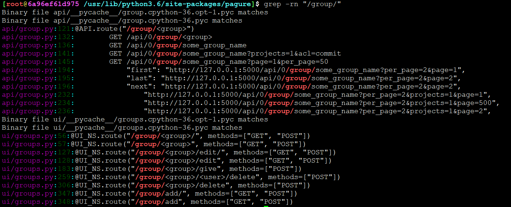


```
/usr/lib/python3.6/site-packages/pagure/api/group.py
```

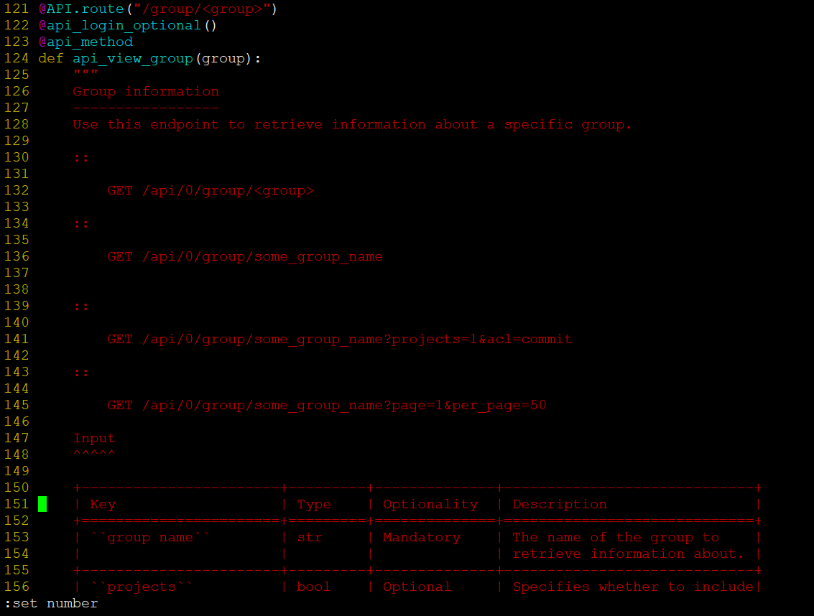

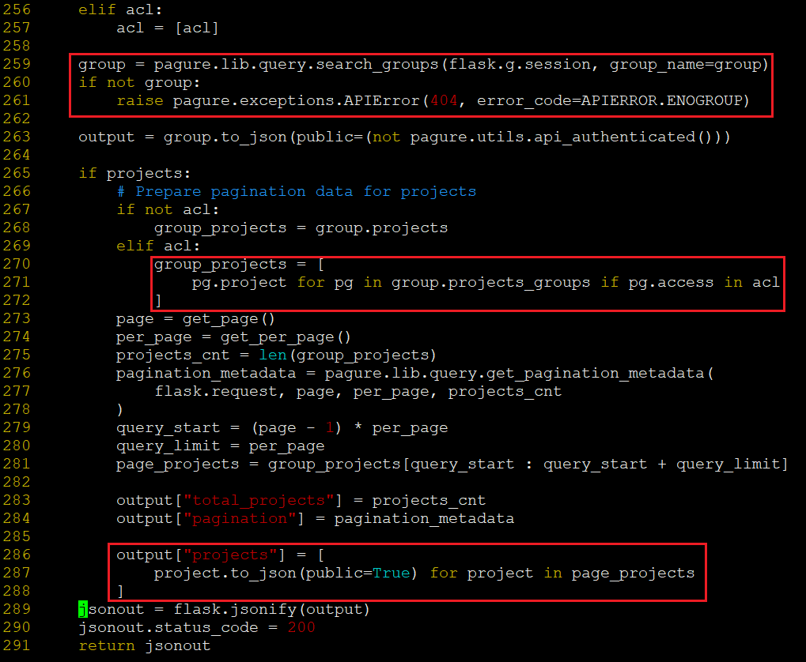

```
/usr/lib/python3.6/site-packages/pagure/lib/query.py
```
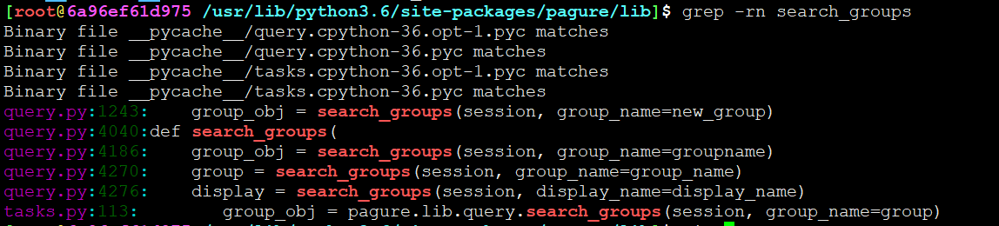

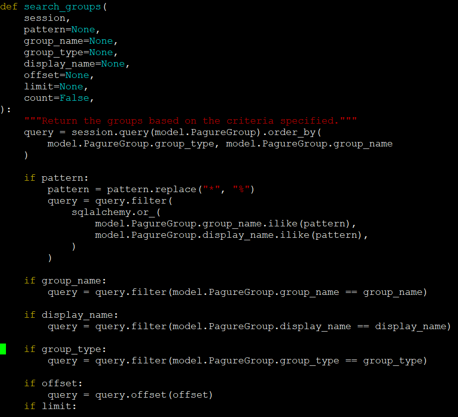


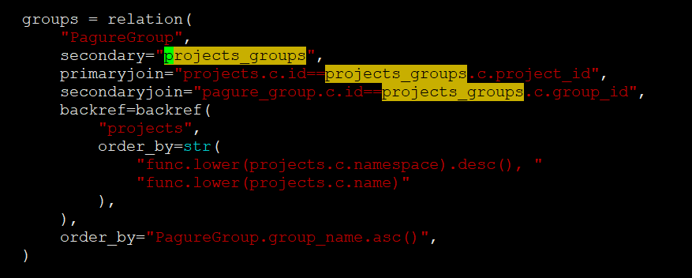


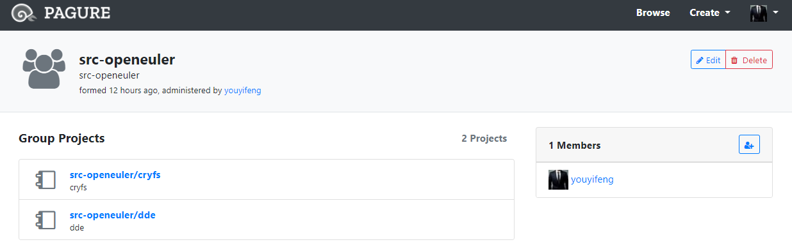

如果 projects_groups 没有写记录，那么就会造成group组没有仓库的情况

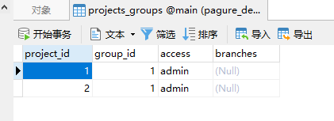

为什么创建的时候没有表生成呢？

项目创建的时候就应该关联上才对

```
/usr/lib/python3.6/site-packages/pagure/lib/query.py
```
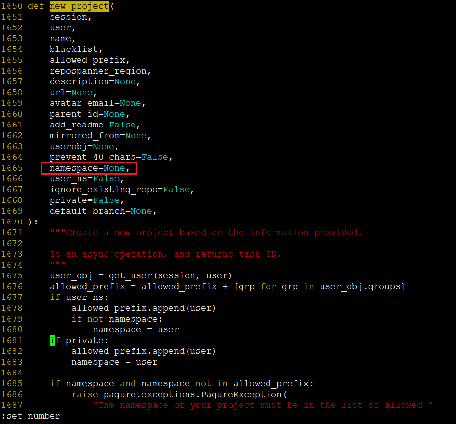

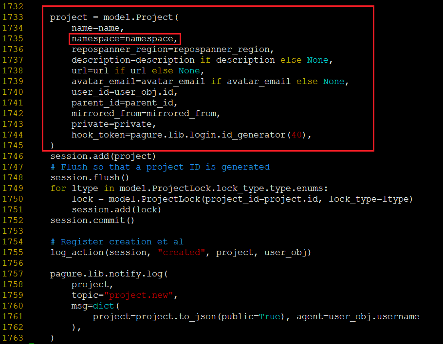

flask orm 对象模型，喝一壶？

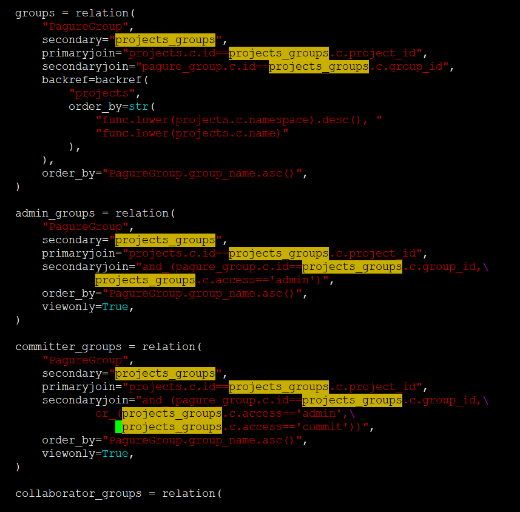


---
