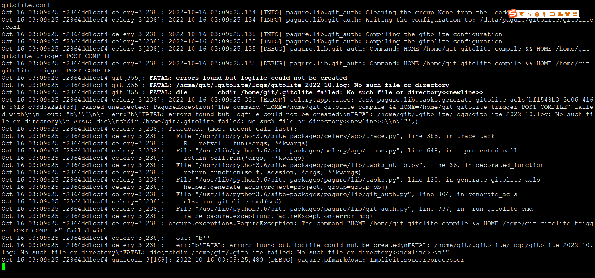
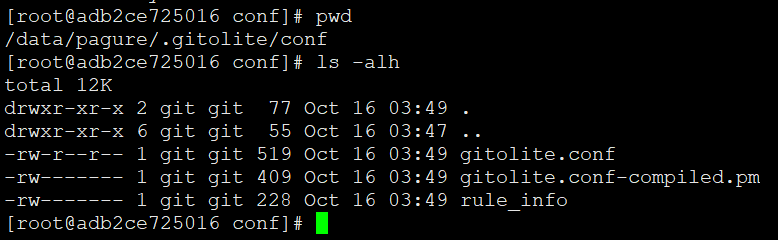
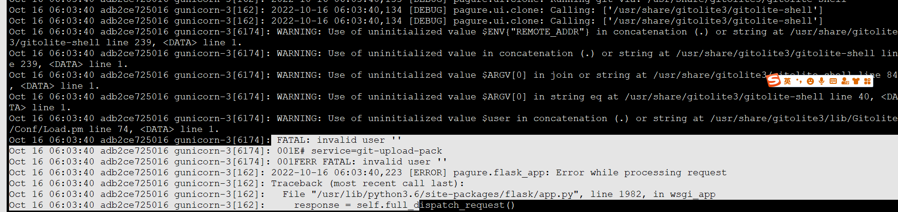

# pagure与gitolite交互



gitolite没配好，肯定要炸


需要提前指定gitolite家目录

```
mkdir -p /data/pagure/.gitolite/{conf,.ssh,logs,hooks} || true
```



```

### Configuration file for gitolite
#GITOLITE_CONFIG = os.path.join(
#    os.path.abspath(os.path.dirname(__file__)),
#    '..',
#    'gitolite.conf'
#)
GITOLITE_CONFIG = "/data/pagure/.gitolite/conf/gitolite.conf"


### Home folder of the gitolite user
### Folder where to run gl-compile-conf from
GITOLITE_HOME = '/data/pagure/'

### Version of gitolite used: 2 or 3?
GITOLITE_VERSION = 3

### Folder containing all the public ssh keys for gitolite
GITOLITE_KEYDIR = '/data/pagure/.gitolite/.ssh'

### Path to the gitolite.rc file
GL_RC = None

### Path to the /bin directory where the gitolite tools can be found
GL_BINDIR = None


```





````
ssh-keygen -f gitolite_rsa -t rsa -N ''
HOME=/data/pagure/ gitolite setup -pk gitolite_rsa.pub

HOME=/data/pagure/ gitolite compile && HOME=/data/pagure/ gitolite trigger POST_COMPILE
````


测试代码片段

```
HOME=/home/git/ gitolite compile && HOME=/home/git/ gitolite trigger POST_COMPILE
cd
ssh-agent bash
ssh-add .ssh/admin
ssh-add -l
git clone git@localhost:gitolite-admin.git $RANDOM.git
git clone git@localhost:src-openeuler/python-apipkg.git $RANDOM.git
exit

HOME=/home/git/ gitolite compile && HOME=/home/git/ gitolite trigger POST_COMPILE
ssh-agent bash
ssh-add youyifeng
ssh-add -l
git clone git@localhost:src-openeuler/python-apipkg.git $RANDOM.git

```


---
