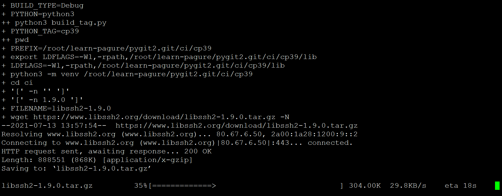
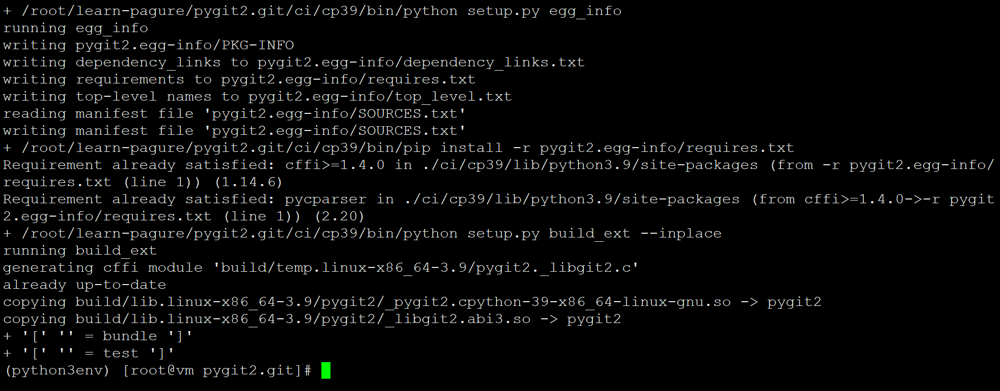
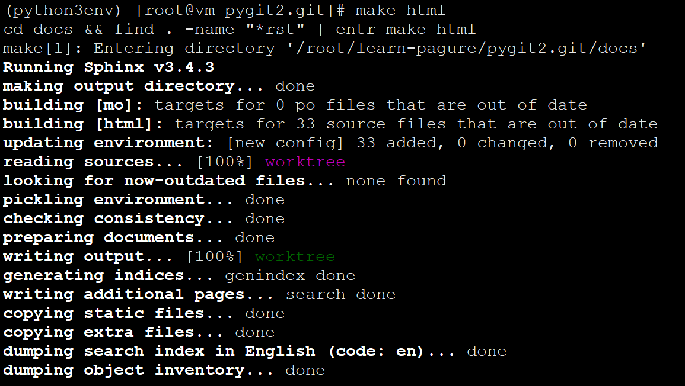
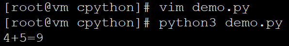

<!-- MDTOC maxdepth:6 firsth1:1 numbering:0 flatten:0 bullets:1 updateOnSave:1 -->

- [pygit2如何调用libgit2](#pygit2如何调用libgit2)   
   - [编译](#编译)   
   - [编译文档](#编译文档)   
   - [Python调用C/C++基本原理](#python调用cc基本原理)   
      - [方法一：侵入式](#方法一：侵入式)   
      - [方法二 非侵入式 ctypes](#方法二-非侵入式-ctypes)   
      - [方法三 cpython](#方法三-cpython)   
   - [最简单的python调用c动态库样例](#最简单的python调用c动态库样例)   

<!-- /MDTOC -->
# pygit2如何调用libgit2

```
Bindings to the libgit2 shared library, implements Git plumbing. Supports Python 3.6+ and PyPy3 7.3+
```

* Pygit2是对libgit2的Python封装，提过简洁的接口访问对象中的各种属性，执行对仓库的各种操作。
* libgit2是Git的共享程序库，相对于作为一个独立程序应用的Git
* libgit2去掉了其中复杂的优化和非核心的功能，更简单，更纯粹。

* pygit2仓库地址：<https://hub.fastgit.org/libgit2/pygit2>
* 开源协议：GPLv2 with linking exception

---

## 编译

```
yum install -y cmake libgit2-devel
make build
```

编译过程依赖网络，下载三方包





## 编译文档

```
yum install -y cmake libgit2-devel entr python3-sphinx
make html
```


## Python调用C/C++基本原理

* 使用Python很方便，但是在效率上比不上C/C++
* 再者，某些时候我们想把一些关键性代码保护起来，我们可以将这些代码编译成C/C++的so库，然后使用Python去调用，能够很好的达到我们的目的。

三种方法：

1. 使用Python扩展
2. 使用ctypes模块直接加载so
3. Cython

### 方法一：侵入式

* 第一种方法是Python为整合其它语言而存在的一种扩展机制，可以是C/C++，也可以是其它语言。
* Python在设计之初就考虑到要让模块的导入机制足够抽象。抽象到让使用模块的代码无法了解到模块的具体实现细节。
* Python的可扩展性具有的优点：方便为语言增加新功能、具有可定制性、代码可以实现复用等

依赖于python头文件

```
#include <Python.h>
```

python的扩展模块由以下几部分组成：

1. Python.h
2. C函数
3. 接口函数（python代码调用的函数）到C函数的映射表
4. 初始化函数

### 方法二 非侵入式 ctypes

ctypes的主要作用就是在python中调用C动态链接库（shared library）中的函数。

* c库无感知，不需要单独调整c库代码
* cffi封装了ctypes
* CFFI(C Foreign Function Interface) 是Python的C语言外部函数接口。


### 方法三 cpython

* python是一种动态类型的解释型语言，执行效率低，Cython在python的基础上增加了可选的静态类型申明的语法
* 代码在使用前先被转换成优化过的C代码，然后编译成python扩展库，大大提升了执行效率。因此从语言的角度来讲
* Cython是python的超集，即扩展了的python
* cffi也支持CPython, 它是ctypes的替代方案，在Python内写C代码和调用C动态库代码，但是比ctypes更方便，干净

<https://cffi-zh-cn.readthedocs.io/zh/latest/overview.html#real-example>

## 最简单的python调用c动态库样例


```
int add(int a, int b)
{
    return a + b;
}
```

```
gcc -shared -o libadd.so libadd.c
```

```
#!/usr/bin/env/python
from ctypes import *
import os
sohandler = cdll.LoadLibrary(os.getcwd()+ "/libadd.so")
print("4+5=%s" % sohandler.add(4,5))
```



* <https://www.cnblogs.com/ccxikka/p/9647108.html>

---
