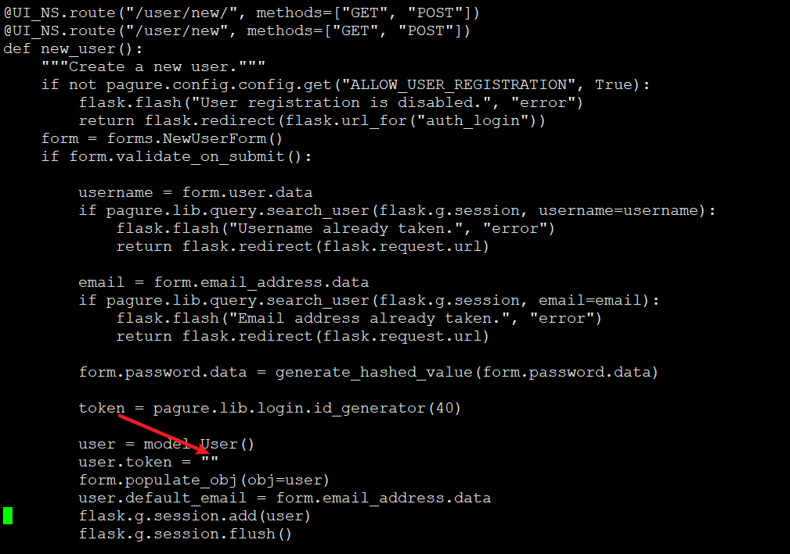
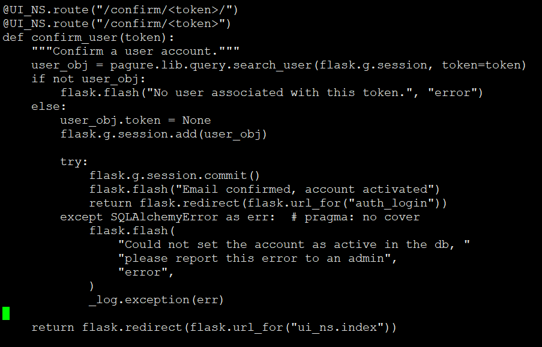
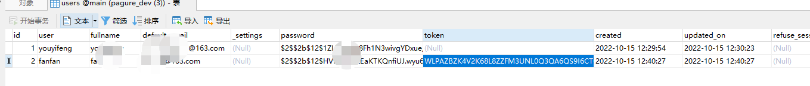

# 注册邮箱验证流程

## 新用户创建

```
/usr/lib/python3.6/site-packages/pagure/ui/login.py
```

根据路由，请求在这里



## 邮箱验证

看路由，代码很清晰

```
/usr/lib/python3.6/site-packages/pagure/ui/login.py
```



根据token检索用户，如果没有找到则返回token未关联用户错误


如果找到用户，则将user表对应用户的toekn字段清空




## 如何关闭邮箱验证

```
# close registration email confirm
sed -i 's/user.token = token/user.token = ""/g' /usr/lib/python3.6/site-packages/pagure/ui/login.py

```

PS: 关闭邮箱安全性绝对堪忧，我又不是不知道，但是，我只是玩玩而已，何必那么认真？


---
