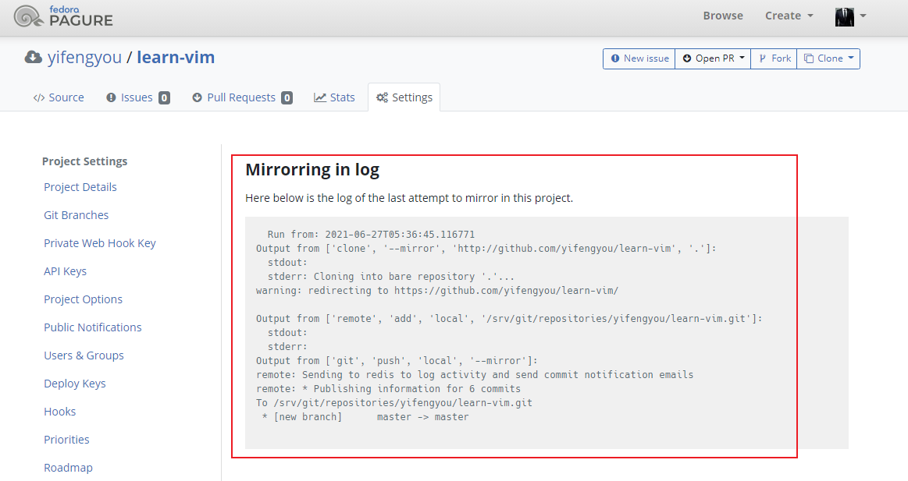
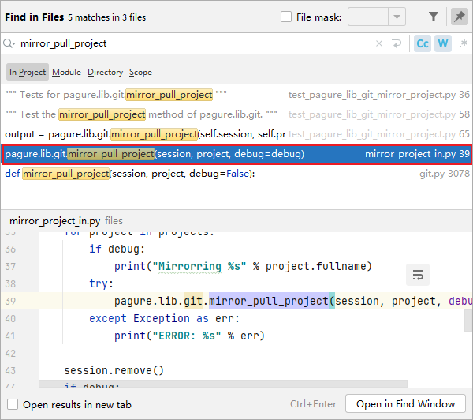
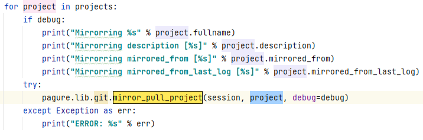
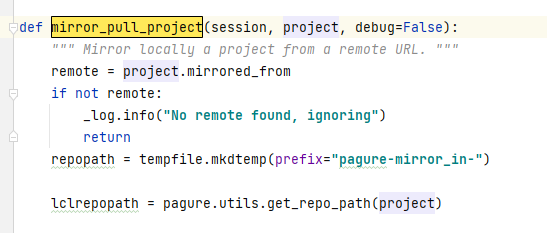
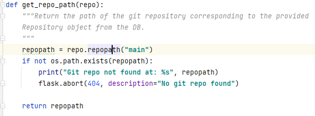
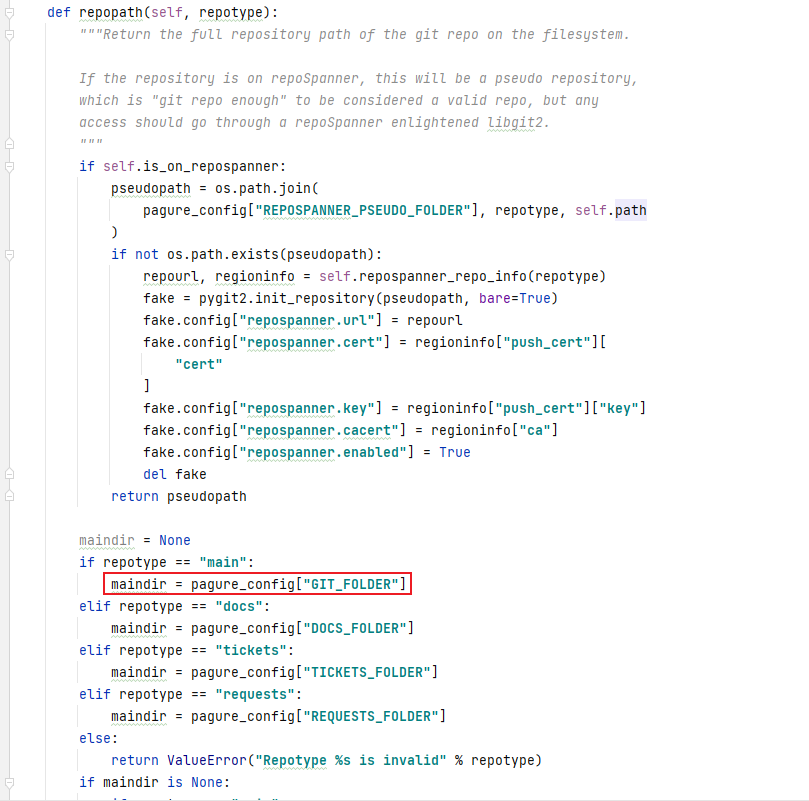
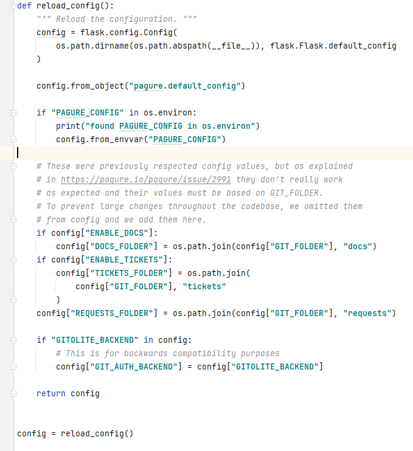
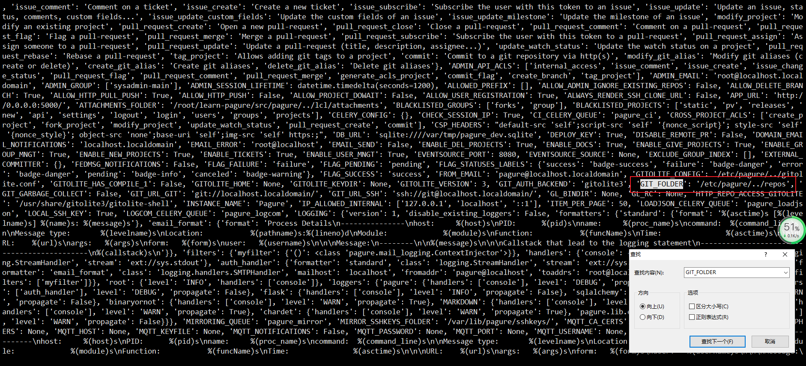
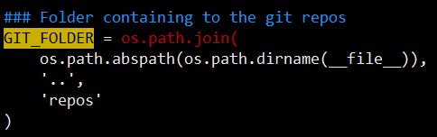

# 镜像站点流程

pagure支持镜像第三方站点（后台clone仓库），不过并不是实时开源镜像，源码看下到底是从何开始




字符串定位法 "--mirror", 定位到 src/pagure/lib/git.py ,蛮长的函数，本质是调用git命令，执行clone，remote add操作

```
def mirror_pull_project(session, project, debug=False):
    """ Mirror locally a project from a remote URL. """
    remote = project.mirrored_from
    if not remote:
        _log.info("No remote found, ignoring")
        return
    repopath = tempfile.mkdtemp(prefix="pagure-mirror_in-")
    lclrepopath = pagure.utils.get_repo_path(project)

    def _run_command(command, logs):
        _log.info("Running the command: %s" % command)
        if debug:
            print("Running the command: %s" % command)
            print("  Running in: %s" % repopath)
        (stdout, stderr) = pagure.lib.git.read_git_lines(
            command, abspath=repopath, error=True
        )
        log = "Output from %s:\n  stdout: %s\n  stderr: %s" % (
            command,
            stdout,
            stderr,
        )
        logs.append(log)
        if debug:
            print(log)
        return logs

    try:
        # Pull
        logs = ["Run from: %s" % datetime.datetime.utcnow().isoformat()]
        logs = _run_command(["clone", "--mirror", remote, "."], logs)
        logs = _run_command(["remote", "add", "local", lclrepopath], logs)

        # Push the changes
        _log.info("Pushing")
        if debug:
            print("Pushing to the local git repo")
        extra = {}
        if project.is_on_repospanner:
            regioninfo = pagure_config["REPOSPANNER_REGIONS"][
                project.repospanner_region
            ]

            extra.update(
                {
                    "username": "pagure",
                    "repotype": "main",
                    "project_name": project.name,
                    "project_user": project.user.username
                    if project.is_fork
                    else "",
                    "project_namespace": project.namespace or "",
                }
            )
            args = []
            for opt in extra:
                args.extend(["--extra", opt, extra[opt]])
            command = [
                "git",
                "-c",
                "protocol.ext.allow=always",
                "push",
                "ext::%s %s %s"
                % (
                    pagure_config["REPOBRIDGE_BINARY"],
                    " ".join(args),
                    project._repospanner_repo_name("main"),
                ),
                "--repo",
                repopath,
            ]
            environ = {
                "USER": "pagure",
                "REPOBRIDGE_CONFIG": ":environment:",
                "REPOBRIDGE_BASEURL": regioninfo["url"],
                "REPOBRIDGE_CA": regioninfo["ca"],
                "REPOBRIDGE_CERT": regioninfo["push_cert"]["cert"],
                "REPOBRIDGE_KEY": regioninfo["push_cert"]["key"],
            }
        else:
            command = ["git", "push", "local", "--mirror"]
            environ = {}

        _log.debug("Running a git push to %s", project.fullname)
        env = os.environ.copy()
        env["GL_USER"] = "pagure"
        env["GL_BYPASS_ACCESS_CHECKS"] = "1"
        env["internal"] = "yes"
        if pagure_config.get("GITOLITE_HOME"):
            env["HOME"] = pagure_config["GITOLITE_HOME"]
        env.update(environ)
        env.update(extra)
        out = subprocess.check_output(
            command, cwd=repopath, stderr=subprocess.STDOUT, env=env
        ).decode("utf-8")
        log = "Output from %s:" % command
        logs.append(log)
        logs.append(out)
        _log.debug("Output: %s" % out)

        project.mirrored_from_last_log = "\n".join(logs)
        session.add(project)
        session.commit()
        _log.info("\n".join(logs))
    except subprocess.CalledProcessError as err:
        _log.debug(
            "Rebase FAILED: {cmd} returned code {code} with the "
            "following output: {output}".format(
                cmd=err.cmd, code=err.returncode, output=err.output
            )
        )
        # This should never really happen, since we control the repos, but
        # this way, we can be sure to get the output logged
        remotes = []
        for line in err.output.decode("utf-8").split("\n"):
            _log.info("Remote line: %s", line)
            if line.startswith("remote: "):
                _log.debug("Remote: %s" % line)
                remotes.append(line[len("remote: ") :].strip())
        if remotes:
            _log.info("Remote rejected with: %s" % remotes)
            raise pagure.exceptions.PagurePushDenied(
                "Remote hook declined the push: %s" % "\n".join(remotes)
            )
        else:
            # Something else happened, pass the original
            _log.exception("Error pushing. Output: %s", err.output)
            raise
    finally:
        shutil.rmtree(repopath)
```


前序调用在src/files/mirror_project_in.py




关键句

```
pagure.lib.git.mirror_pull_project(session, project, debug=debug)
```





跳转到 pagure/lib/git.py




关键句，此处会判断路径，常见路径错误就需要在这里定位

```
lclrepopath = pagure.utils.get_repo_path(project)
```



关键句

```
repopath = repo.repopath("main")
```

这里repo是一个类，repopath是该类的public方法，这个类是

pagure/lib/model.py中定义的

```
class Project(BASE)
```



注释中提到，该方法用于定位repo仓库所在路径。
这里还需要做个条件判断，repoSpanner是什么鬼？

```
Return the full repository path of the git repo on the filesystem.

If the repository is on repoSpanner, this will be a pseudo repository,
which is "git repo enough" to be considered a valid repo, but any
access should go through a repoSpanner enlightened libgit2.
```

直接跳过，此处状态机，莫名其妙的pagure_config参数是从哪里获取到的？？？

```
if repotype == "main":
    maindir = pagure_config["GIT_FOLDER"]
elif repotype == "docs":
    maindir = pagure_config["DOCS_FOLDER"]
elif repotype == "tickets":
    maindir = pagure_config["TICKETS_FOLDER"]
elif repotype == "requests":
    maindir = pagure_config["REQUESTS_FOLDER"]
else:
    return ValueError("Repotype %s is invalid" % repotype)
```


```
export PAGURE_CONFIG="/etc/pagure/pagure.cfg"
python3 mirror_project_in.py  --debug
```

mirror_project_in.py不能正常运行有很大一部分可能是pagure_config配置问题，造成Not Found。那么pagure_config是怎么初始化来的？




在 mirror_project_in.py 最开始有一个加载函数

```
_config = pagure.config.reload_config()
```

类型是 ```<class 'flask.config.Config'>```


pagure_config 也是 ```<class 'flask.config.Config'>```

在repopath中添加简单粗暴的输出语句

```
print("type(pagure_config):[%s]" % type(pagure_config))
print("pagure_config:[%s]" % str(pagure_config))
```

快速定位到GIT_FOLDER路径



这个路径是怎么来的嘞？

查看一下配置文件，这里有句话：



配置文件其实也是python脚本，开头还有import语句，不单单是简单的配置文件
这里还用到了__file__这，其实就是对应的python脚本，也就是配置文件所在路径

因为我的配置是酱紫的

```
export PAGURE_CONFIG="/etc/pagure/pagure.cfg"
```

则GIT_FOLDER地址就变成了

```
/etc/pagure/../repos
```


---
